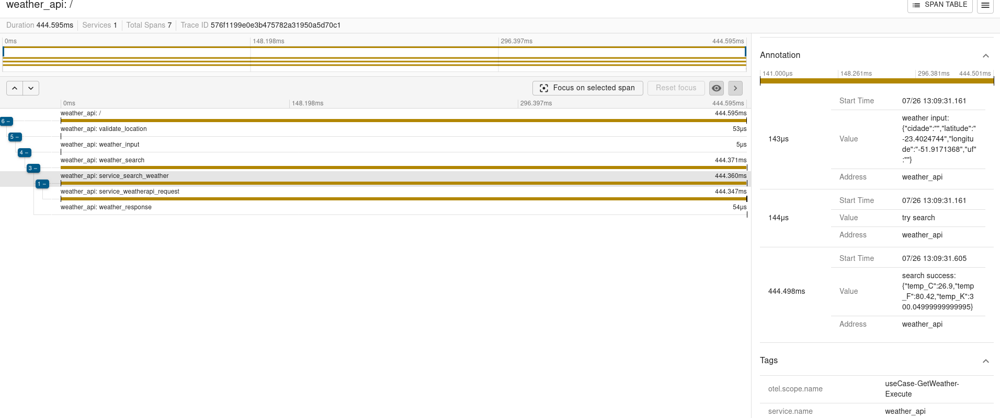

# pos_go_weather_otel
Sistema em Go que recebe um CEP, identifica a cidade e retorna o clima atual (temperatura em graus celsius, fahrenheit e kelvin) juntamente com a cidade. Esse sistema comtempla observabilidade com o padrão OTEL(Open Telemetry) e Zipkin.

Basedo no cenário conhecido [pos_go_weather](https://github.com/nagahshi/pos_go_weather) foi implementado a consulta entre serviços. O propósito do exercício é avaliar as habilidades de tracing distribuído, então utilizei a mesma API para realizar as consultas.

## Setup
Tenha instalado Docker em seu ambiente, ambas API's e o serviço de tracing distribuído serão instalados e confirgurados via docker compose.

Antes de subir a aplicação o `Serviço B` necessita de uma chave para API de consulta [WeatherAPI](http://weatherapi.com). Atualize o arquivo `docker-compose.yaml` com a chave na váriavel de ambiente `WEATHER_API_KEY`.

Colocando a aplicação no ar:
```sh
docker-compose up
```
*ps: certifique-se que as portas: 8080, 8081 e 9411 estejam disponíveis*

## Uso
`Serviço A` tem a responsabilidade de validar e consultar o CEP(zipcode) informado via [POST] request na rota:

```sh
POST http://localhost:8080/cep HTTP/1.1
Content-Type: application/json
{
   "cep":"87033080"
}
```

`Serviço A` trata e valida informações de CEP(zipcode) e efetua a consulta usando a API aberta da [BrasilAPI](https://brasilapi.com.br) API obtendo latitude e longitude do CEP informado. Com essas informações realiza uma consulta no `Serviço B` que usa API da [WeatherAPI](http://weatherapi.com) para obter o clima atual (temperatura em graus celsius, fahrenheit e kelvin).

Retorno esperado:
```sh
{
    "city": "São Paulo",
    "temp_C": 27.5,
    "temp_F": 81.5,
    "temp_K": 300.65
}
```

## zipkin
O serviço do zipkin ficará disponível na porta: 9411 conforme a configuração de seu `docker-compose.yaml` o tracing é separado em 2 serviços `cep_api` e `weather_api`.


Exemplo de tracing no `Serviço A` com seus eventos e atributos:


`Serviço B` para mesma requisição acima:
